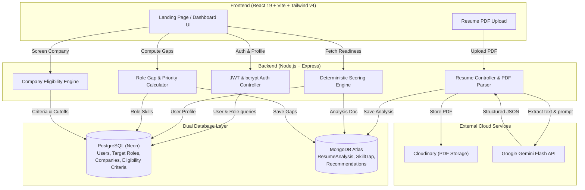

# Nexora — AI Career Readiness & Placement Platform

<div align="center">

[](https://react.dev/)
[](https://nodejs.org/)
[-4169E1?style=flat-square&logo=postgresql)](https://neon.tech/)
[](https://www.mongodb.com/)
[](https://ai.google.dev/)
[](https://tailwindcss.com/)

**One score. Every gap. What to learn next.**  
*Upload a resume, compare it with a role, check illustrative company criteria, and see what to learn next.*

</div>

---

## 📑 Table of Contents

- [Overview & Problem Statement](#-overview--problem-statement)
- [System Architecture](#-system-architecture)
- [Core Features & Capabilities](#-core-features--capabilities)
- [Readiness Scoring Formula](#-readiness-scoring-formula)
- [Tech Stack](#-tech-stack)
- [Database Architecture](#-database-architecture)
- [API Reference](#-api-reference)
- [Local Setup & Development](#-local-setup--development)
- [Production Deployment Guide](#-production-deployment-guide)
  - [1. Backend on Render](#1-backend-deployment-render)
  - [2. Frontend on Vercel](#2-frontend-deployment-vercel)
- [Testing & Quality Assurance](#-testing--quality-assurance)

---

## 🎯 Overview & Problem Statement

College students and early-career software engineers often face an ambiguous hiring landscape:
- Generic resume reviewers provide qualitative feedback without actionable metrics.
- Job seekers rarely know whether they satisfy rigid academic/skill cutoffs for top employers.
- Candidates lack clear, prioritized roadmaps showing what to learn next to bridge the gap.

**Nexora solves this by combining:**
1. **Resume Analysis**: Uses Google Gemini to extract skills, strengths, weaknesses, and suggestions from PDF resume text.
2. **Readiness Score**: Calculates a repeatable score from profile completeness, resume analysis, role skill match, and experience signals.
3. **Role Gap Analysis**: Set-difference matching against industry benchmarks, ranking every missing requirement by hiring priority.
4. **Company Checks**: Compares CGPA, graduation year, and analyzed resume skills with illustrative criteria. Criteria are approximate examples, not official company requirements.
5. **Learning Suggestions**: Shows skills missing from the selected role and links to related learning resources.

---

## 🏗 System Architecture



---

## ✨ Core Features & Capabilities

| Feature | Description |
| :--- | :--- |
| **Public Landing Page (`/`)** | Explains the resume, role, company-check, and learning-suggestion flow with links to register/login. |
| **Role Selection & Profile Sync** | Pick from standard target benchmarks (Frontend, Backend, Full Stack, Data Analyst) or define custom career pathways. |
| **AI Resume Analysis** | Upload PDF resumes to Cloudinary; Gemini Flash extracts skills, strengths, weaknesses, and suggestions. |
| **Multi-Factor Scorecard** | Real-time score (0–100) combining profile completeness, resume quality, skill match, and experience signals. |
| **Skill Gap Matrix** | Normalized set-difference matching that highlights missing competencies grouped by **High**, **Medium**, and **Low** priority. |
| **Company Checks** | Free-text or listed-company checks against illustrative CGPA, batch, and skill criteria. |
| **Learning Suggestions** | Links to learning resources for skills missing from the selected role comparison. |

Company criteria are approximate examples, not official company requirements. Unmatched company and role inputs are labelled as general guidance.

---

## 📐 Readiness Scoring Formula

Nexora combines four weighted components into a repeatable score for the saved profile and analysis:

$$\text{Readiness Score} = \Big(\text{ProfileCompleteness} \times 0.25\Big) + \Big(\text{ResumeQuality} \times 0.35\Big) + \Big(\text{SkillMatch} \times 0.30\Big) + \Big(\text{ExperienceBonus} \times 0.10\Big)$$

### Weight Breakdown:
1. **Profile Completeness (25%)**: Ratio of completed profile fields (CGPA, Graduation Year, GitHub, LinkedIn, Portfolio, Target Role).
2. **Resume Quality (35%)**: Composite of extracted technical skills, concrete strengths, structural suggestions, and calibrated LLM quality index.
3. **Skill Match (30%)**: Case-insensitive overlap of extracted resume skills and the selected role's listed skills.
4. **Experience Signal Bonus (10%)**: Based on portfolio links or experience-related text in the resume analysis.

---

## 💻 Tech Stack

### Frontend
- **Framework**: React 19 + Vite
- **Routing**: React Router v7
- **Styling**: Tailwind CSS v4 (Design tokens: `#FBFAF6` canvas, `#1F6F5C` forest green, `#12181B` ink text)
- **Icons**: Lucide React
- **Typography**: Fraunces for the landing headline and dashboard greeting; Inter for other interface text; IBM Plex Mono for selected numeric values.

### Backend
- **Runtime**: Node.js (CommonJS)
- **Framework**: Express 5
- **Authentication**: JWT (JSON Web Tokens) + salted bcrypt password hashing
- **File Upload**: Multer + Cloudinary Storage
- **PDF Extraction**: `pdf-parse` v2 stream buffer parser
- **AI Processing**: Google Generative AI SDK (`@google/generative-ai`, model: `gemini-flash-latest`)

### Databases
- **PostgreSQL (Neon Serverless)**: Relational schema for users, target roles, companies, and eligibility criteria.
- **MongoDB Atlas (Mongoose)**: Document store for unstructured AI analyses, skill gaps, and recommendation records.

---

## 🗄️ Database Architecture

### PostgreSQL (Relational)
- **`users`**: `id (SERIAL)`, `name`, `email (UNIQUE)`, `password_hash`, `cgpa`, `grad_year`, `github_url`, `linkedin_url`, `portfolio_url`, `target_role_id (FK)`
- **`target_roles`**: `id (SERIAL)`, `name`, `expected_skills (TEXT[])`
- **`companies`**: `id (SERIAL)`, `name`
- **`eligibility_criteria`**: `id (SERIAL)`, `company_id (FK)`, `min_cgpa`, `min_grad_year`, `required_skills (TEXT[])`

### MongoDB (Document Store)
- **`ResumeAnalysis`**: `{ userId, resumeUrl, extractedSkills[], strengths[], weaknesses[], suggestions[], readinessScore, deterministicReadinessScore, createdAt }`
- **`SkillGap`**: `{ userId, targetRole, missingSkills[], priority: Map<String, String>, isEstimate, note, createdAt }`
- **`Recommendation`**: `{ userId, items: [{ skill, priority, resourceUrl }], createdAt }`

---

## 📡 API Reference

### Authentication
```http
POST /api/auth/register
Content-Type: application/json

{ "name": "Dhruv Patil", "email": "dhruv@example.com", "password": "securepassword" }
```
```http
POST /api/auth/login
Content-Type: application/json

{ "email": "dhruv@example.com", "password": "securepassword" }
```

### Profile & Target Roles
- `GET /api/profile` — Get authenticated user profile (`Bearer <token>`).
- `PUT /api/profile` — Update CGPA, grad year, social links, target role.
- `GET /api/profile/roles` — List target roles and required skills.
- `GET /api/profile/companies` — List available companies for eligibility screening.

### Assessment & Readiness
- `GET /api/profile/readiness?targetRoleId=X` — Calculate 4-factor readiness score breakdown.
- `POST /api/profile/skill-gap` — Compute missing competencies and priority ranking.
- `GET /api/profile/skill-gap` — Retrieve latest computed skill gap analysis.
- `GET /api/profile/eligibility?companyId=X` — Evaluate student eligibility against company criteria.
- `GET /api/profile/recommendations?targetRole=...` — Fetch learning suggestions for a selected role after resume analysis.

### Resume Upload & AI Analysis
- `POST /api/resume/upload` — Multipart form-data with `resume` PDF file.
- `POST /api/resume/analyze` — Trigger Gemini Flash analysis for `{ resumeId }`.

---

## 🛠 Local Setup & Development

### Prerequisites
- Node.js 18+ and npm
- PostgreSQL connection string (e.g., Neon)
- MongoDB Atlas connection string
- Cloudinary Account (Cloud Name, API Key, API Secret)
- Google Gemini API Key

### 1. Clone & Configure Environment
```bash
git clone https://github.com/anishagrawal25/Nexora.git
cd Nexora
```

Create `server/.env`:
```env
PORT=5000
DATABASE_URL=postgresql://<user>:<password>@<host>/<dbname>?sslmode=require
MONGO_URI=mongodb+srv://<user>:<password>@<cluster>.mongodb.net/nexora?retryWrites=true&w=majority
JWT_SECRET=replace_with_a_random_secret_at_least_32_characters_long
CLIENT_ORIGIN=http://localhost:5173
CLOUDINARY_CLOUD_NAME=your_cloud_name
CLOUDINARY_API_KEY=your_cloudinary_api_key
CLOUDINARY_API_SECRET=your_cloudinary_api_secret
GEMINI_API_KEY=your_gemini_api_key
```

### 2. Start Backend
```bash
cd server
npm install
npm test          # Run server unit tests
npm run dev       # Starts server on http://localhost:5000
```

### 3. Start Frontend
```bash
cd ../client
npm install
npm run dev       # Starts Vite dev server on http://localhost:5173
```

---

## 🚢 Production Deployment Guide

### 1. Backend Deployment (Render)

1. Sign in to [Render](https://render.com) and click **New → Web Service**.
2. Connect your GitHub repository (`Nexora`).
3. Configure settings:
   - **Root Directory**: `server`
   - **Environment**: `Node`
   - **Build Command**: `npm install`
   - **Start Command**: `npm start`
4. Add the following **Environment Variables** in Render Dashboard:
   - `DATABASE_URL` — Neon PostgreSQL connection string with SSL
   - `MONGO_URI` — MongoDB Atlas connection string
   - `JWT_SECRET` — Long random string (32+ chars)
    - `CLIENT_ORIGIN` — Exact Vercel site origin (for example `https://nexora-blush-two-24.vercel.app`). Comma-separate additional allowed origins if needed.
   - `GEMINI_API_KEY` — Google Gemini API key
   - `CLOUDINARY_CLOUD_NAME` — Cloudinary Cloud Name
   - `CLOUDINARY_API_KEY` — Cloudinary API Key
   - `CLOUDINARY_API_SECRET` — Cloudinary API Secret
   - `NODE_ENV` — `production`
5. Click **Create Web Service**. Note your backend URL (e.g. `https://nexora-api.onrender.com`).

---

### 2. Frontend Deployment (Vercel)

1. Sign in to [Vercel](https://vercel.com) and click **Add New → Project**.
2. Select your `Nexora` GitHub repository.
3. Configure settings:
   - **Root Directory**: Click *Edit* and select `client`.
   - **Framework Preset**: `Vite` (automatically detected).
   - **Build Command**: `npm run build`
   - **Output Directory**: `dist`
4. In **Environment Variables**, add:
   - `VITE_API_URL` = `https://<your-render-backend-url>/api` (e.g. `https://nexora-api.onrender.com/api`)
5. Click **Deploy**.
6. [client/vercel.json](client/vercel.json) is configured with SPA route rewrites so direct navigation to `/dashboard`, `/login`, and `/register` works.

---

## 🧪 Testing & Quality Assurance

Nexora includes an automated unit test suite using Node's built-in test runner (`node:test` + `node:assert/strict`):

```bash
cd server
npm test
```

### Test Coverage:
- `calculateProfileCompleteness`: Null safety, proportional weighting, 100% boundary check.
- `calculateSkillMatch`: Case-insensitive matching, empty arrays, exact match ratios.
- `calculateExperienceBonus`: Portfolio link detection, keyword signals in resume text.
- `calculateReadiness`: Combined weighted 4-factor scoring and null tolerance.
- `findResource`: Exact and alias resource lookups with search fallback.
- `validateEmail` & `validatePassword`: Strict format and length validations.
- `getRoleFallback` & `getCompanyFallback`: Heuristic categorization and estimate flags.
